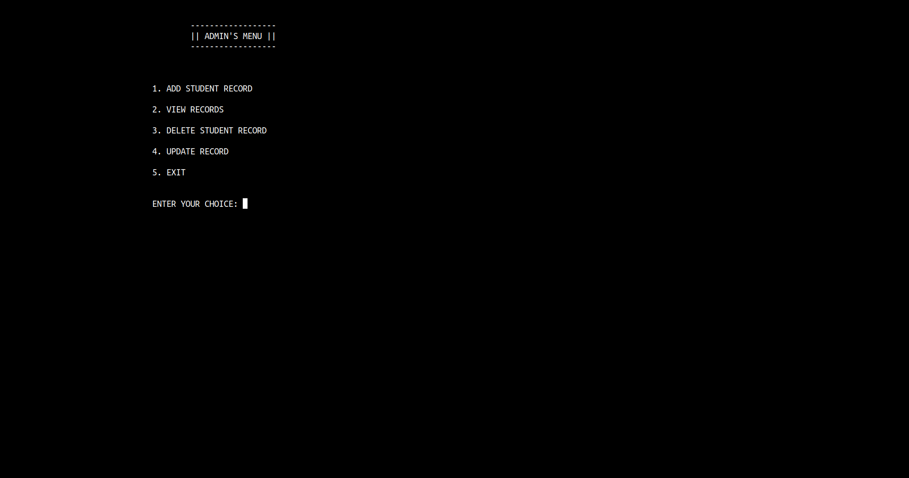
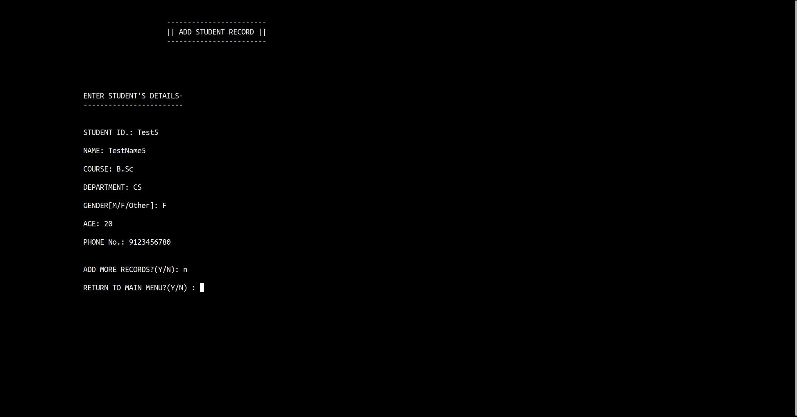
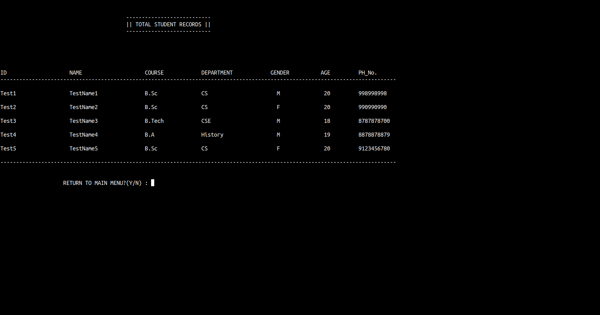
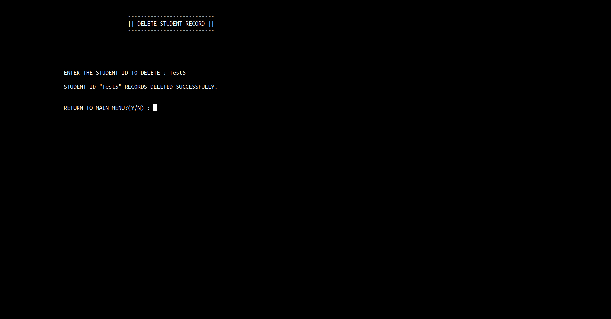

# Student Data Manager

## A simple console program to manage student's official data.

Store records like student_id, name, course, department, phone no. etc.
It writes records into a .csv file that can be opened with any spreadsheet software like google sheets,microsoft excel,libreoffice calc.
Until now options to add,view and delete records are available.

>**Note**
> As I have used the linux/unix specific library *unistd.h* to use functions like `sleep()` and `system("clear")`, the cpp files will  only compile on linux/unix based operating systems. Soon I'll be adding detailed steps on **changes to be made to compile these files on other operating system like Windows.**

### Few screenshots of the program running in terminal-

### Features to be implemented further and soon are:

1.  Updating any student's record.
1.  Searching any student's record by ID.

>> Duplicate id's won't be allowed.

### To get and run this program, run these commands in your terminal:

1.  git clone git@github.com:Bishnukt/Student_Data_Manager.git
1.  cd Student_Data_Manager
1.  g++ -o sdm sdm.cpp admin.cpp load.cpp
1.  ./sdm
